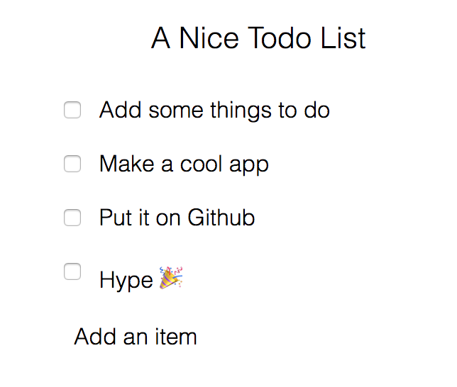
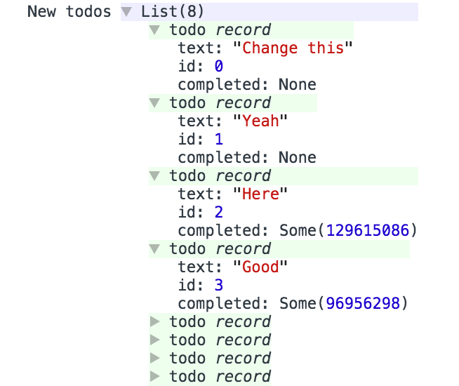

# Isomagic Todos App

Here's an example app that does a couple of neat tricks:

- the server is compiled with bsb-native
- the client is compiled with bsb
- they share some code
- it uses some custom ppxs that are installed via npm
  - `ppx_autoserialize`, which gives us json stringify/parse for free for all
    custom types, as well as nice chrome devtools object printing
  - `ppx_async`, for `async/await` goodness
  - `ppx_guard`, for `guard let` a la swift

#### Here's some chrome devtools

